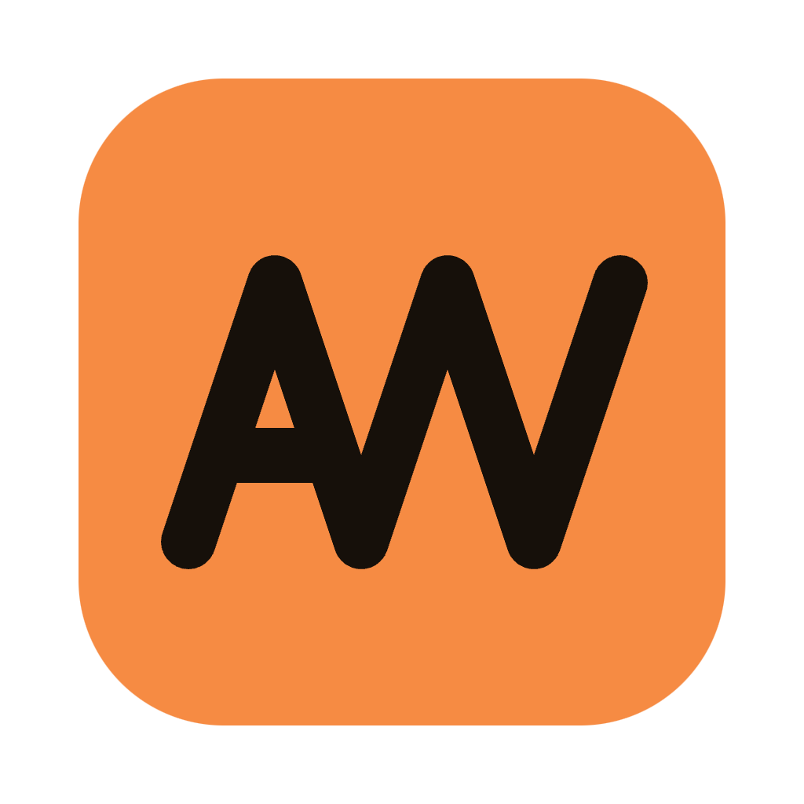

#  Autowright

> Describe the job once. Your Mac does it every day, exactly the same way, forever.

**Website: [autowright.ai](https://autowright.ai)**

Autowright is a desktop app for recurring personal automations. Everyone has small
recurring chores a computer should handle: checking a site for updates, pulling a report,
filing downloads. But scripting them yourself is work, chatbots re-improvise the task on
every run, and cloud platforms mean subscriptions and your credentials on someone else's
servers.

Autowright uses AI once, at authoring time. You describe the job in plain words, a connected
AI agent (Claude Code, Gemini CLI, Codex, OpenCode, or a local Ollama model) writes it as
human-readable Python step scripts, you review and approve, and a local scheduler runs those
exact scripts on time. No re-prompting, context drift, or subscriptions.

## Features

- **Plain-words authoring and editing** — The AI does the scripting, you do the deciding;
  nothing executes until you approve it.
- **Bring your own agent** — Claude Code, Gemini CLI, Codex, or OpenCode; OpenCode can drive
  a local Ollama model for fully offline drafting.
- **Real scheduling** — Cron with per-trigger timezones, one-shot triggers, run-on-app-start,
  and manual "Execute now". Runs even with the app closed (launchd service) with a
  missed-run policy for sleep and downtime.
- **Versioned automations** — Every approved edit is a new version; drafts run in isolation
  before you promote them.
- **Persistent memory with snapshots** — Automations keep state between runs, with automatic
  snapshots and one-click restore.
- **Live execution view** — Per-step status, streamed logs, and full execution history.
- **Menu-bar surface** — Glance at what's running and fire jobs without opening the window.
- **Local and file-first** — Automations are YAML and Python on disk, secrets stay in the
  macOS Keychain, and everything runs on your Mac; portable `.autowright` export/import.

## Planned Features

- **First packaged release** — A signed `Autowright.app` and DMG download (today you build
  from source).
- **Linux and Windows support** — Currently macOS only.
- **More install options** — Homebrew for the app, and a headless pip package for running
  the backend and CLI without the desktop app.
- **CLI with full app parity** — Author automations as files, execute and follow them,
  manage secrets and triggers. Headless- and agent-friendly with explicit per-automation
  secret grants.
- **Agent skills** — Drive Autowright straight from your agent chat session (create, edit,
  and run automations without opening the app).
- **GitHub sync** — Keep your automations in a GitHub repo and pull changes into the app.
- **Automation & agent marketplace** — Browse, share, and install automations and agents
  made by others.
- **More harness integrations** — Beyond the current four (Claude Code, Gemini CLI, Codex,
  OpenCode).
- **Richer triggers** — React to file-system changes, calendar events, and more.

## Status

Unreleased and under active development, macOS only right now. `SPEC.md` is the source of truth for
the whole app; see §18 for the dev workflow.
